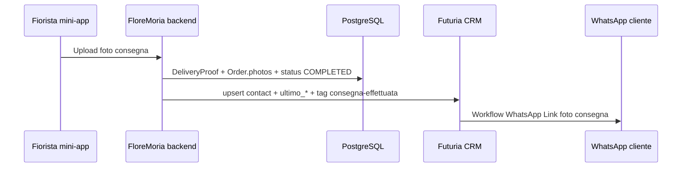

# Futuria — WhatsApp Link foto consegna

Workflow Futuria: **WhatsApp Link foto consegna**  
Tag di attivazione: `floremoria-consegna-effettuata`

FloreMoria aggiorna il contatto cliente su Futuria al momento della **convalida consegna** da parte del fiorista (ordine → `COMPLETED`). L'invio WhatsApp avviene interamente lato Futuria quando il tag viene applicato.

## Trigger backend

File: `lib/deliveryProof/submitFloristProof.ts` → `sendMagicPhotoDeliveryToFuturia` (`lib/futuria/magicPhotoDeliveryNotify.ts`)

1. Il fiorista carica foto prima/dopo nella mini-app consegna.
2. Le foto vengono salvate su `DeliveryProof` e **iniettate esplicitamente** su `Order.photos` (oltre a Giardino utente, profilo defunto e portfolio fiorista).
3. FloreMoria effettua **un solo upsert** contatto via `lib/futuria/contactGate.ts`:
   - contatto già presente → `paid_order_followup`
   - contatto assente ma ordine pagato → `paid_order`
4. Viene applicato il tag `floremoria-consegna-effettuata`.

## Custom field da creare su Futuria (modello Contact)

| Chiave GHL (fieldKey) | Variabile workflow | Esempio |
|----------------------|-------------------|---------|
| `contact.ultimo_prodotto_consegnato` | `{{ contact.ultimo_prodotto_consegnato }}` | Bouquet Cordoglio Sincero con Candele |
| `contact.ultimo_defunto_associato` | `{{ contact.ultimo_defunto_associato }}` | Maria Rossi |
| `contact.ultimo_cimitero_comune` | `{{ contact.ultimo_cimitero_comune }}` | Palermo |
| `contact.ultimo_magic_link` | `{{ contact.ultimo_magic_link }}` | `https://www.floremoria.com/auth/magic-photo?token=…` |

Override opzionali via env:

- `FUTURIA_CF_ULTIMO_PRODOTTO_CONSEGNATO_KEY`
- `FUTURIA_CF_ULTIMO_DEFUNTO_ASSOCIATO_KEY`
- `FUTURIA_CF_ULTIMO_CIMITERO_COMUNE_KEY`
- `FUTURIA_CF_ULTIMO_MAGIC_LINK_KEY`
- `FUTURIA_TAG_CONSEGNA_EFFETTUATA` (default: `floremoria-consegna-effettuata`)

## Configurazione workflow Futuria

### 1. Trigger

- **Tipo:** Tag applicato
- **Tag:** `floremoria-consegna-effettuata`
- **Filtro consigliato:** contatto con telefono valido e campo `ultimo_magic_link` non vuoto

### 2. Messaggio WhatsApp (corpo)

```
Gentile {{ contact.first_name }},

i tuoi fiori {{ contact.ultimo_prodotto_consegnato }} sono stati posati sulla tomba di {{ contact.ultimo_defunto_associato }} presso il cimitero di {{ contact.ultimo_cimitero_comune }}.

Grazie per aver scelto FloreMoria: conserviamo per te le foto della consegna nel tuo Giardino della Memoria.
```

Adattare il saluto se `first_name` non è valorizzato (fallback su nome completo contatto).

### 3. Pulsante CTA

| Campo | Valore |
|-------|--------|
| Testo pulsante | `Vedi le foto` (o `FOTO`) |
| URL | `{{ contact.ultimo_magic_link }}` |

Il magic link scade dopo **24 ore** e atterra su `/auth/magic-photo`, che reindirizza l'utente alla dashboard ordine/Giardino.

### 4. Note operative

- **Non** inviare WhatsApp direttamente da FloreMoria per questo flusso: il backend imposta solo i custom field e il tag.
- Il tag può essere ri-applicato su ordini successivi: i campi `ultimo_*` vengono sempre sovrascritti con l'ultima consegna.
- `ultimo_prodotto_consegnato` include bouquet principali ed eventuali accessori (formato: `Bouquet X con Accessorio Y`).
- Location Futuria: `FUTURIA_LOCATION_ID` (env produzione).

## Flusso dati (schema)



## Verifica post-deploy

1. Completare una consegna test (ordine Palermo o staging).
2. Su Futuria → Contatti: verificare i 4 custom field e il tag.
3. Confermare ricezione WhatsApp con testo e pulsante corretti.
4. Aprire `ultimo_magic_link` entro 24h e verificare accesso alle foto ordine.
