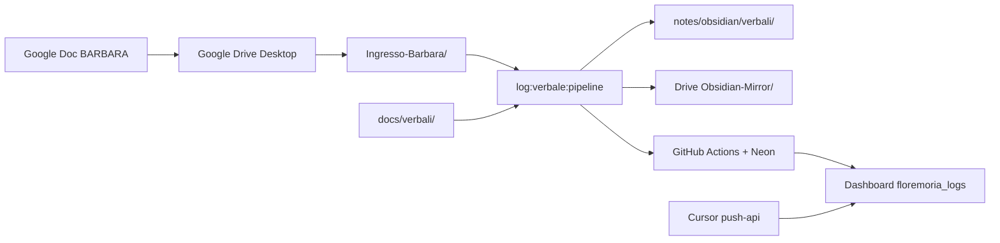

# Sync verbali — setup automatico (BARBARA → Obsidian → Dashboard)

Aggiornato: 2026-06-19 · Agenti: DEVIN, PETRA, VITO

---

## Flusso target (zero copia-incolla)



| Step | Comando / trigger |
|------|-------------------|
| Setup Drive (una tantum) | `npm run verbali:setup-drive` |
| Verifica chiavi auth | `npm run verbali:verify-keys` |
| Merge BARBARA + docs → Obsidian | `npm run log:verbale:pipeline` |
| Sync dashboard (ieri o ISO forzato) | `npm run log:verbale:daily` |
| Push manuale su Neon produzione | `npm run log:verbale:push-api` |

---

## 1. Allineamento chiavi (fix 401)

### Endpoint autorizzati

| Endpoint | Metodo | Header |
|----------|--------|--------|
| `/api/logs/sync-verbale` | GET (probe) / POST (upsert) | `x-admin-key` **oppure** `x-api-key` |
| `/api/logs/update` | POST | `x-api-key` (webhook, upsert BARBARA) |
| `/api/admin/sync-verbale` | POST | `x-admin-key` (+ middleware cookie bypass se chiave valida) |

Logica centralizzata: `lib/auth/verbaleSyncAuth.ts`

### Variabili `.env.local` (Mac) = Vercel Production

| Variabile | Uso |
|-----------|-----|
| `ADMIN_API_KEY` | Header `x-admin-key` — **deve coincidere** con Vercel |
| `FLOREMORIA_WEBHOOK_KEY` | Header `x-api-key` — **deve coincidere** con Vercel |
| `VERBALI_SYNC_PRODUCTION_URL` | Default `https://www.floremoria.com` |

### Procedura allineamento

```bash
# 1. Scarica env produzione (se CLI Vercel collegata)
npx vercel env pull .env.vercel.production.local --environment=production

# 2. Copia in .env.local i valori di ADMIN_API_KEY e FLOREMORIA_WEBHOOK_KEY

# 3. Verifica (GET senza scrittura DB)
npm run verbali:verify-keys
```

**Esito atteso:** almeno una riga ✓ (webhook o admin).

### Causa storica del 401

1. **Middleware** su `/api/admin/*` richiedeva cookie Super Admin → risolto con bypass `x-admin-key` valida.
2. **`ADMIN_API_KEY` locale ≠ Vercel** → `push-api` falliva anche con route corretta.
3. **Soluzione operativa immediata:** `FLOREMORIA_WEBHOOK_KEY` allineata (funziona su `/api/logs/update` e `/api/logs/sync-verbale`).

---

## 2. Ponte Google Drive Desktop

### Percorso predefinito Mac

```
~/Google Drive/Il mio Drive/FloreMoria - Verbali/
├── Ingresso-Barbara/    ← Google Doc esportati .md (BARBARA)
├── Obsidian-Mirror/     ← mirror automatico pipeline
├── Docs-Mirror/         ← mirror docs/verbali/
└── README.txt
```

### Setup

```bash
npm run verbali:setup-drive
```

Aggiungi a `.env.local`:

```env
GOOGLE_DRIVE_VERBALI_DIR="/Users/floremoria/Google Drive/Il mio Drive/FloreMoria - Verbali"
```

### Convenzione file in Ingresso-Barbara (Standard Barbara)

- **`DD-MM-YYYY.md`** (es. `20-07-2026.md` — **Standard principale uffizioso per Barbara**)
- Supportati in fallback: `YYYY-MM-DD.md` o `YYYY-MM-DD-Verbale-Giornaliero.md`

I Google Doc nativi (`.gdoc`) **non** sono markdown: esporta da Docs → **File → Scarica → Markdown** nella cartella sincronizzata, oppure usa Antigravity/Second Brain che già produce `.md`.

### Integrazione codice

- Lettura ingress: `lib/verbali/googleDriveBridge.ts` + `lib/verbali/barbaraSource.ts`
- Scrittura mirror: `lib/verbali/mirrorPaths.ts` → `mirrorVerbaleToGoogleDrive()`

---

## 3. CI GitHub Actions

Secret obbligatorio: `DATABASE_URL` → **stesso Neon** usato da Vercel Production.

Workflow: `.github/workflows/verbale-pipeline.yml` — sync automatica su push `docs/verbali/**`.

---

## Troubleshooting

| Sintomo | Azione |
|---------|--------|
| 401 su push-api | `npm run verbali:verify-keys` → allinea chiavi Vercel |
| Verbale in Obsidian, non in dashboard | `npm run log:verbale:push-api` o verifica secret CI |
| Drive non sincronizza | Google Drive Desktop acceso; cartella in `GOOGLE_DRIVE_VERBALI_DIR` |
| `tsc` errori | `npx tsc --noEmit` prima del push |
